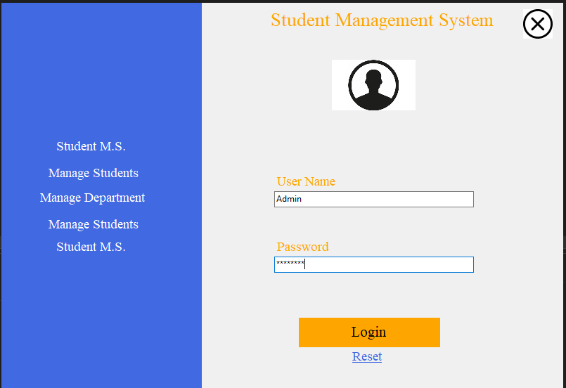
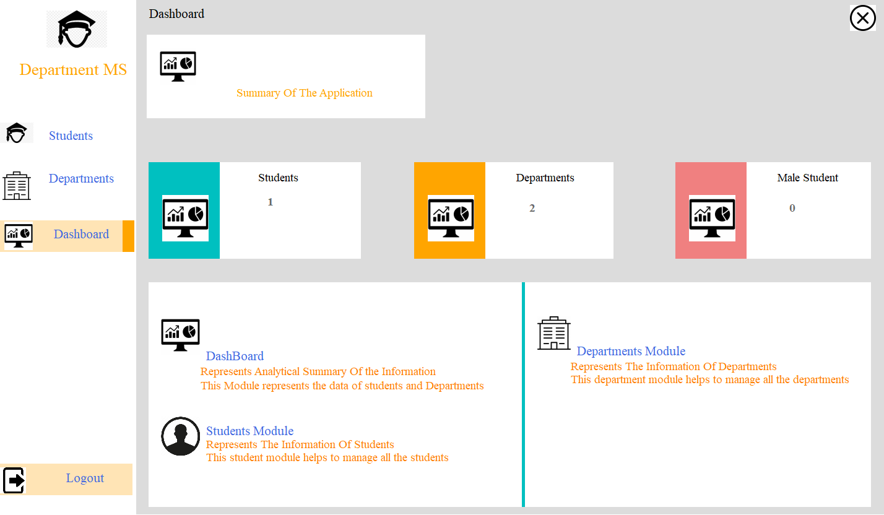
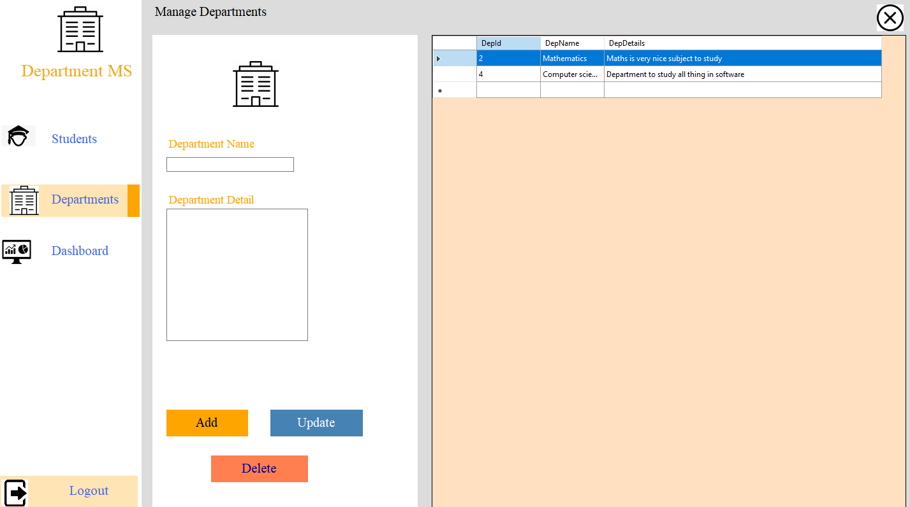
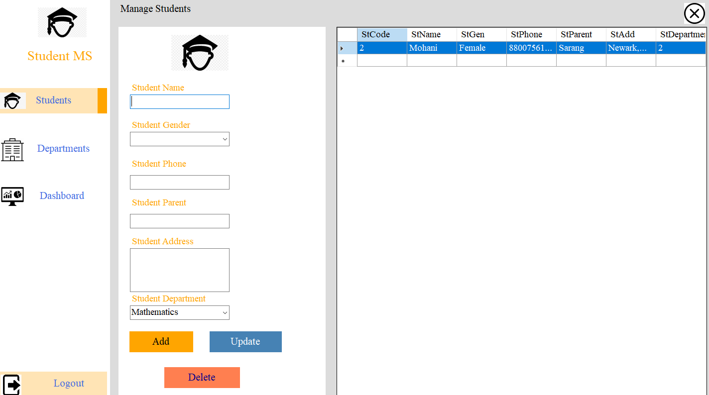

# StudentManagementSystem

It is a student management system developed using C#, ADO.NET and Microsoft SQL server.

## Application screenshots

1. Login page - Administrator username and password
   username: Admin
   password: Password

2. Dashboard - This is the first screen after login. It displays the summary of departments and students.

3. Department - This shows a gridview of all departments in the database along with its metadata. - Has CRUD operation functionality using text boxes to update fields.

4. Student - Shows grid view of all students by connecting to DB - Has CRUD operation functionality using text boxes to update fields.

